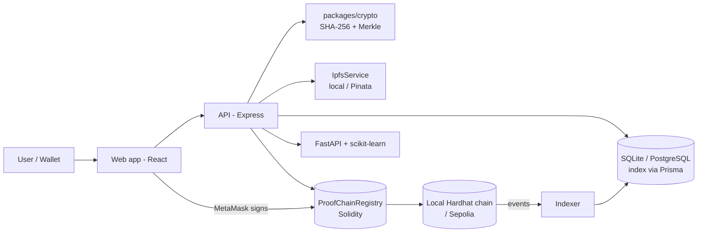

# ProofChain

**Trust the Origin. Verify the Integrity.**

A blockchain-backed provenance and integrity platform for **AI datasets**, **ML models**
and **software releases**. Artifacts are cryptographically fingerprinted (SHA-256 /
Merkle root), stored through an IPFS-compatible layer, committed immutably to an
Ethereum smart contract, and verifiable by anyone who holds a copy of the bytes. An
AI service (scikit-learn Isolation Forest + deterministic rules) analyzes each
artifact's real history for anomalies.

```
ARTIFACT → SHA-256 → MERKLE ROOT → METADATA → IPFS/STORAGE
        → SMART CONTRACT → BLOCKCHAIN → IMMUTABLE PROVENANCE
        → VERIFICATION → AI RISK ANALYSIS
```

---

## Problem statement

Digital artifacts that machines trust are mutable and mostly unverifiable:

- datasets get relabeled after results are published;
- model weights get swapped between evaluation and deployment;
- package releases get rebuilt with something extra inside;
- metadata says whatever its editor wants it to say.

A checksum published next to the file proves nothing — whoever can change the file
can change the checksum. What is needed is a **commitment that the artifact's author
cannot silently rewrite**, plus a way for any third party to check a copy against it.

## Objectives

1. Register artifacts with a reproducible cryptographic fingerprint.
2. Commit that fingerprint, ownership and lineage to an immutable ledger.
3. Let anyone verify a copy against the on-chain commitment and see exactly what changed.
4. Track versions, derivations, ownership transfers and revocations as auditable events.
5. Flag statistically unusual artifact behavior with a real ML model — without ever
   claiming the model "proves" anything.

## Architecture — separation of responsibilities

This separation is the core design principle:

| Layer | Responsibility | Implementation |
|---|---|---|
| **Blockchain** | Immutable provenance: fingerprints, ownership, lineage, audit events | Solidity `ProofChainRegistry` on Hardhat (Sepolia-ready) |
| **Cryptography** | Integrity and tamper detection | SHA-256 + hand-implemented Merkle tree (`packages/crypto`) |
| **Storage / IPFS** | Large files + metadata documents | Content-addressed local store, Pinata/IPFS via env switch |
| **Database** | Fast queries, users, analytics — an **index**, not a ledger | SQLite via Prisma (PostgreSQL-compatible schema) |
| **AI** | Anomaly/risk analysis over real history | FastAPI + scikit-learn Isolation Forest + rule baseline |

The database is rebuildable at any time by replaying contract events from the deploy
block (`apps/api/src/services/indexer.ts`) — the chain remains the single source of
truth for everything provenance-related.



## Repository layout

```
proofchain/
  apps/
    web/          React + Vite + TS console and landing page
    api/          Express + TS API, Prisma, chain indexer, storage, demo engine
    ai-service/   FastAPI + scikit-learn anomaly analysis
  blockchain/
    contracts/    ProofChainRegistry.sol, ProofCertificate.sol (ERC-721, soulbound)
    scripts/      deploy.js (writes deployments/<network>.json)
    test/         30 Hardhat tests
  packages/
    crypto/       isomorphic SHA-256 + Merkle tree + manifests (+16 tests)
    shared/       contract ABIs, constants, formatting
    types/        shared TypeScript types
  storage/        content-addressed local object store (gitignored)
  scripts/        dev.mjs (one-command stack), start-ai.mjs, e2e-check.mjs
  docs/           architecture, blockchain, smart contract, AI, API, demo, syllabus
  docker/         optional PostgreSQL compose (not required)
```

## Technology stack

Solidity 0.8.28 (Cancun EVM, viaIR) · Hardhat 2 · OpenZeppelin 5 · ethers v6 ·
Node 18+ · Express · Prisma (SQLite default / PostgreSQL-ready) · zod · JWT ·
multer · Python 3.10 · FastAPI · scikit-learn (IsolationForest) · React 18 · Vite ·
TanStack Query · React Flow · WebCrypto.

---

## Installation

Prerequisites: **Node ≥ 18**, **npm**, **Python ≥ 3.10** (optional — only for the AI
service), **Git**. No Docker, no PostgreSQL, no paid API keys required.

```bash
git clone <this repo>
cd proofchain
npm install
```

The Python virtualenv for the AI service is created automatically on first
`npm run ai` (or by `npm run dev`).

## Running locally

**One command (recommended):**

```bash
npm run dev
```

This starts the Hardhat chain, deploys the contracts (first run), sets up the SQLite
database + seed users (first run), then launches the API (port 4000), the AI service
(port 8000, skipped gracefully if Python is missing) and the web app
(http://localhost:5173).

**Classic multi-terminal workflow:**

```bash
# terminal 1 — local Ethereum node (chainId 31337)
npm run chain

# terminal 2 — compile + deploy contracts, records deployments/localhost.json
npm run deploy

# terminal 3 — database setup (SQLite + prisma generate + seed users), then API
npm run db:setup
npm run api

# terminal 4 — AI service (optional)
npm run ai

# terminal 5 — web app
npm run web
```

## Environment variables

Copy `.env.example` to `.env` (everything has a working local default — the stack
runs with **no `.env` at all**):

| Variable | Default | Purpose |
|---|---|---|
| `DATABASE_URL` | `file:./data/proofchain.db` | SQLite file; point at PostgreSQL after switching the Prisma provider |
| `RPC_URL` | `http://127.0.0.1:8545` | Ethereum JSON-RPC endpoint |
| `CHAIN_ID` / `NETWORK_NAME` | `31337` / `localhost` | Which deployment record to load |
| `PRIVATE_KEY` | Hardhat dev account #0 | Server-side signer (demo mode / no-wallet fallback). **Never a real key in the repo** |
| `CONTRACT_ADDRESS` / `CERTIFICATE_ADDRESS` | auto | Overrides `blockchain/deployments/<network>.json` |
| `IPFS_MODE` | `local` | `local` (content-addressed dev store) or `pinata` |
| `PINATA_JWT` / `PINATA_GATEWAY` | — | Real IPFS pinning when configured |
| `AI_SERVICE_URL` | `http://127.0.0.1:8000` | FastAPI analysis service |
| `API_PORT` / `JWT_SECRET` / `MAX_UPLOAD_MB` / `MAX_FILES_PER_ARTIFACT` | `4000` / dev value / `200` / `2000` | API settings |
| `SEPOLIA_RPC_URL` | — | Optional public-testnet deployment |

Never commit `.env`, private keys, seed phrases or API tokens (`.gitignore` covers them).

## Demo credentials (application accounts)

All seeded accounts use password **`proofchain-demo`**:

| Email | Role | Can |
|---|---|---|
| `admin@proofchain.local` | ADMIN | everything incl. demo controls |
| `researcher@proofchain.local` | RESEARCHER | register datasets/models/versions |
| `developer@proofchain.local` | DEVELOPER | register software releases |
| `auditor@proofchain.local` | AUDITOR | read + review verifications |
| `viewer@proofchain.local` | VIEWER | read-only |

Application roles authorize **API** operations only. On-chain ownership is enforced
by the smart contract per wallet address — a deliberate, visible separation.

## Demo flow (presentation script)

1. `npm run dev`, open http://localhost:5173 — landing page hashes its own tagline
   in your browser and shows live registry data.
2. **Open Console** → sign in as `admin@proofchain.local`.
3. **Settings → LOAD DEMO DATA** — ~14 real transactions register the Flood
   Detection Dataset lineage (v1.0→v1.1→v1.2), FloodNet models (derived from the
   dataset), flood-detector-api releases (incl. a deliberately anomalous v1.1.1),
   an ownership transfer and an on-chain revocation; AI analyses run for all.
4. **Register** your own artifact: drop files → watch the client-side SHA-256 /
   Merkle root → commit via MetaMask **or** the labeled local dev signer → real tx
   hash, block number, gas.
5. **Verify** the same files → ✓ INTEGRITY VERIFIED (hash, tx, block, contract).
6. **Settings → SIMULATE INTEGRITY VIOLATION** — rewrites stored bytes of the
   Sensor Calibration Dataset (a real storage-level attack).
7. **RUN VERIFICATION DEMO** → intact artifact passes; tampered artifact fails with
   registered vs current hashes and the exact modified file (`calibration.csv`).
8. **AI Analysis** on `flood-detector-api v1.1.1` → elevated score with
   SIZE_JUMP / RAPID_REVERSIONING / ML_OUTLIER signals (Isolation Forest, ML mode).
9. **Artifact page → New version** — provenance graph grows; **Blockchain** page
   shows the real blocks, transactions and contract events.
10. **RESET DEMO** deploys a fresh registry (the old ledger stays immutable on the
    dev chain — the point demonstrates itself) and clears the index.

MetaMask setup for step 4: add network `http://127.0.0.1:8545`, chainId `31337`, and
import a Hardhat dev key if you want a funded local account (the app can also prompt
network switching automatically).

## Testing

```bash
npm test                 # crypto (16) + contracts (30) + API (10)
npm run test:contracts   # Hardhat suite only
cd apps/ai-service && .venv/Scripts/python -m pytest   # AI (11 tests)
cd apps/web && npx vitest run                          # UI components (3)
node scripts/e2e-check.mjs                             # live end-to-end (23 checks; stack must be running)
```

Latest full run: **70 automated tests + 23 live e2e checks, all passing** (see
`docs/demo.md` for the transcript).

## Documentation

- [docs/architecture.md](docs/architecture.md) — system + sequence diagrams (Mermaid)
- [docs/blockchain.md](docs/blockchain.md) — why a chain, network config, indexer design
- [docs/smart-contract.md](docs/smart-contract.md) — `ProofChainRegistry` + `ProofCertificate` reference
- [docs/ai.md](docs/ai.md) — features, rules, Isolation Forest, honest-language policy
- [docs/api.md](docs/api.md) — REST reference
- [docs/demo.md](docs/demo.md) — demo engine internals + verified test transcript
- [docs/syllabus-mapping.md](docs/syllabus-mapping.md) — honest mapping to the blockchain syllabus

## Deployment notes

- **Sepolia:** set `SEPOLIA_RPC_URL` + a funded `PRIVATE_KEY`, run
  `npm run deploy:sepolia --workspace @proofchain/blockchain`, then point the API at
  it with `NETWORK_NAME=sepolia`, `CHAIN_ID=11155111`, `RPC_URL=<same url>`. The
  contracts, indexer and UI are network-agnostic.
- **PostgreSQL:** change `provider` to `postgresql` in `apps/api/prisma/schema.prisma`,
  set `DATABASE_URL`, run `npm run db:setup`. The schema deliberately avoids
  SQLite-only or Postgres-only features. `docker/docker-compose.yml` starts a local
  Postgres if you have Docker (optional).

## Known limitations

- Local mode labels storage references `local:<sha256>` and calls them what they are
  ("Local Development Storage") — real CIDs appear only in Pinata mode.
- The server dev signer holds Hardhat's publicly known key — it exists for local
  demos and would be replaced by wallet-only signing in production.
- `getArtifactsByOwner` scans on-chain artifacts (fine as an off-chain view call at
  this scale; an event-indexed lookup would replace it at production scale).
- Verification events and AI analyses live in the application DB, not on-chain
  (by design: audit events that need immutability are the contract's four events).
- Uploads are capped (200 MB / 2000 files by default) and hashed in memory.
- The AI model trains on the registered population at request time; with few
  artifacts it honestly reports BASELINE mode rather than pretending.

## Future scope

Chunked/streaming hashing for multi-GB artifacts · per-file Merkle proofs in the UI
(the crypto package already produces them) · IPFS pinning redundancy · EIP-712
signed metadata · organization/multi-sig ownership · Sepolia CI deployment ·
Hyperledger-style permissioned deployment study (see syllabus mapping).
