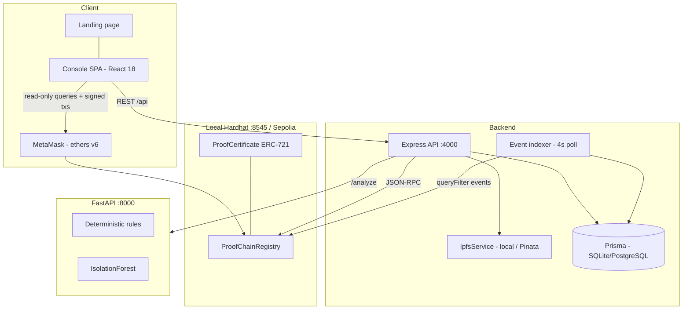
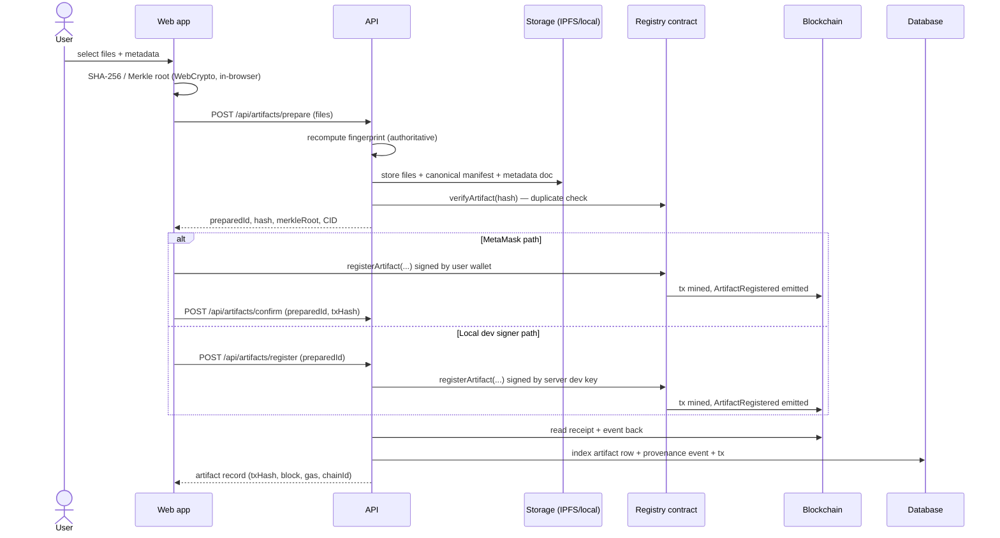
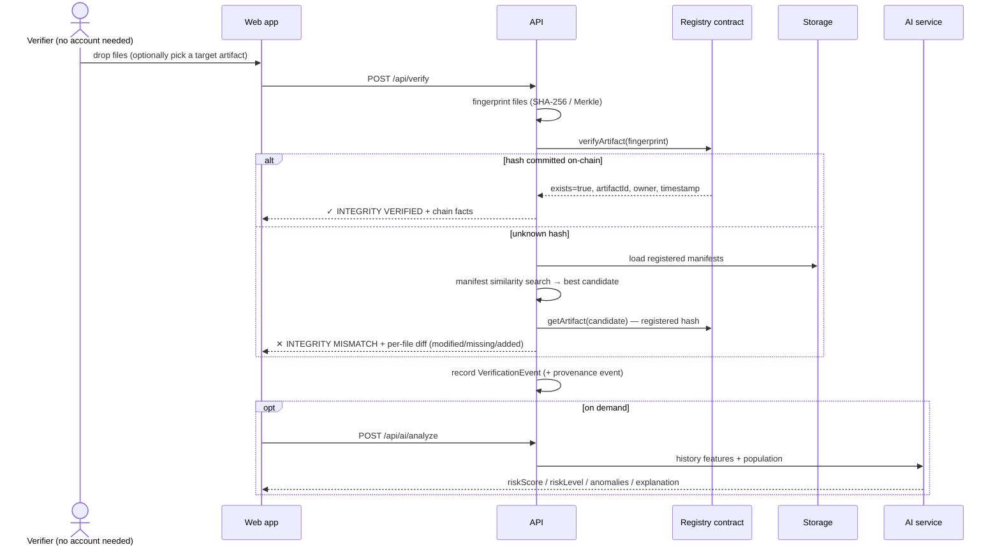
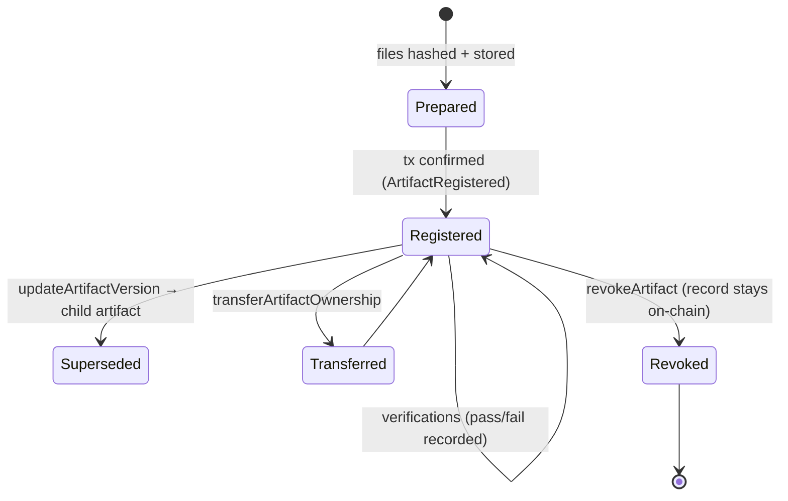
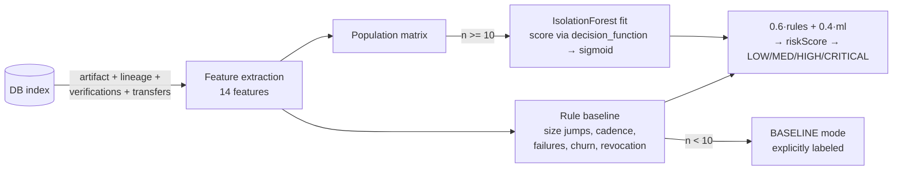

# ProofChain — Architecture

## Design principle

ProofChain is **not** "a CRUD app with a blockchain badge". Each layer does the one
thing it is uniquely good at, and removing any layer breaks a real capability:

| Layer | Uniquely provides | If you removed it |
|---|---|---|
| Cryptography | A fingerprint that changes when any byte changes | No tamper detection at all |
| Blockchain | A commitment nobody — including the operator — can rewrite | Checksums become as mutable as the files |
| Storage/IPFS | Content-addressed bytes + metadata documents | Nothing to verify or re-serve |
| Database | Millisecond queries, pagination, dashboards | Every page load replays chain logs |
| AI service | Statistical anomaly signals over history | No risk triage (integrity still works) |

## System architecture

## Artifact registration sequence

The UI shows the true machine state at every step:
`PREPARING → STORING → SIGNING → PENDING → CONFIRMED/FAILED` — success is never
claimed before the receipt confirms.

## Verification sequence

## Artifact lifecycle

## Provenance graph model

Lineage is a single on-chain parent pointer per artifact:

- **version edge** — child has the same name+type as parent (`updateArtifactVersion`
  or a version-style `registerArtifact`);
- **derived edge** — different name/type (e.g. FloodNet Model v1 ← Flood Detection
  Dataset v1.2), which may cross owners.

The API groups artifacts into families by root ancestor (`rootChainId`) and serves
`{nodes, edges}`; the web app lays them out generation-by-generation in React Flow.

## AI analysis pipeline

## Why the database can never lie about provenance

Every provenance-bearing row in the database carries the chain coordinates that
prove it (`txHash`, `blockNumber`, `contractAddress`), and the indexer can rebuild
the whole index from `deployBlock` by replaying the four contract events. Anyone can
bypass the API entirely and check `artifactIdByHash(hash)` on the contract — the
database is a convenience, not an authority.
